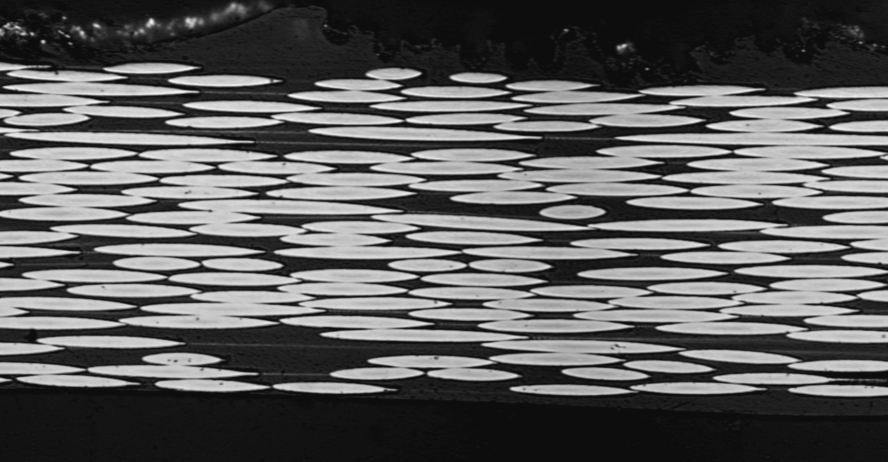
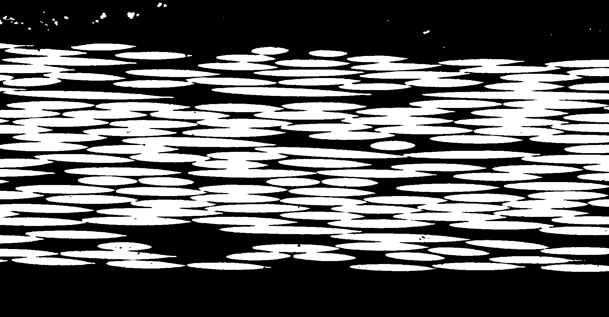
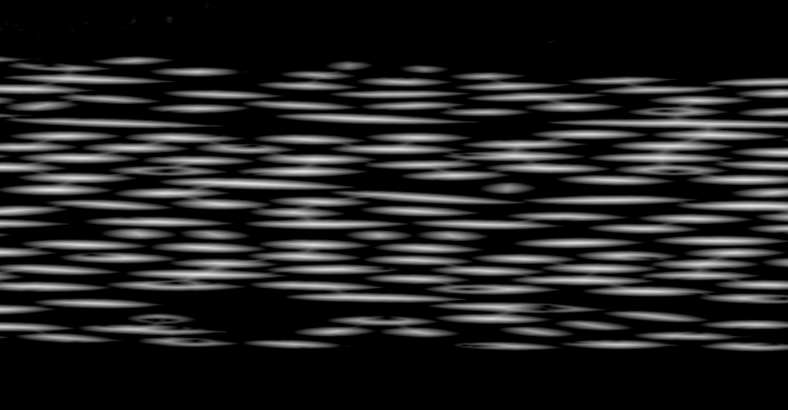
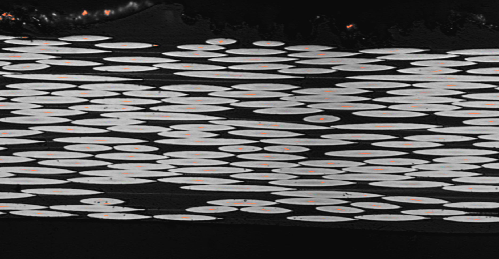
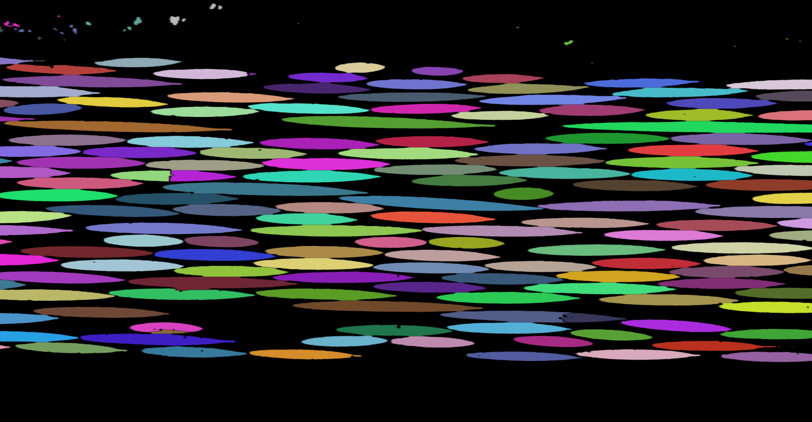
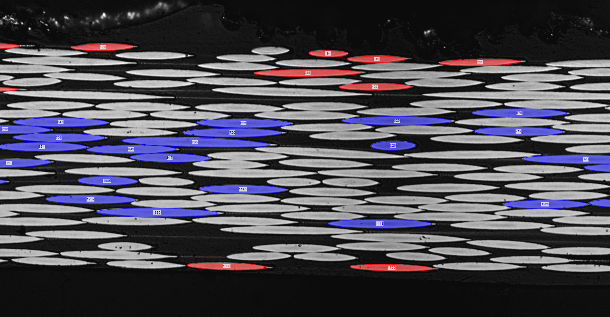
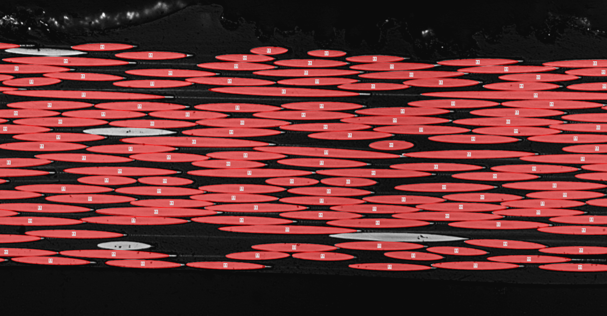
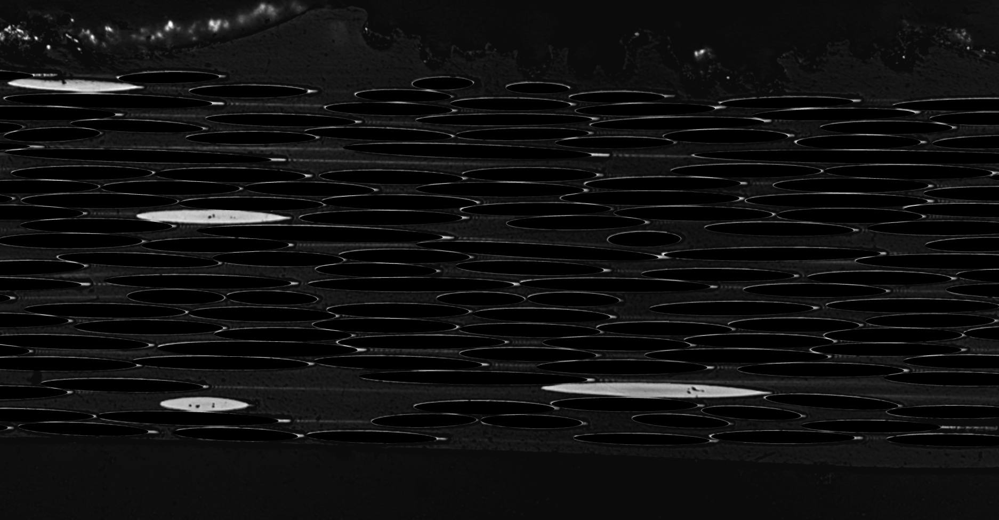
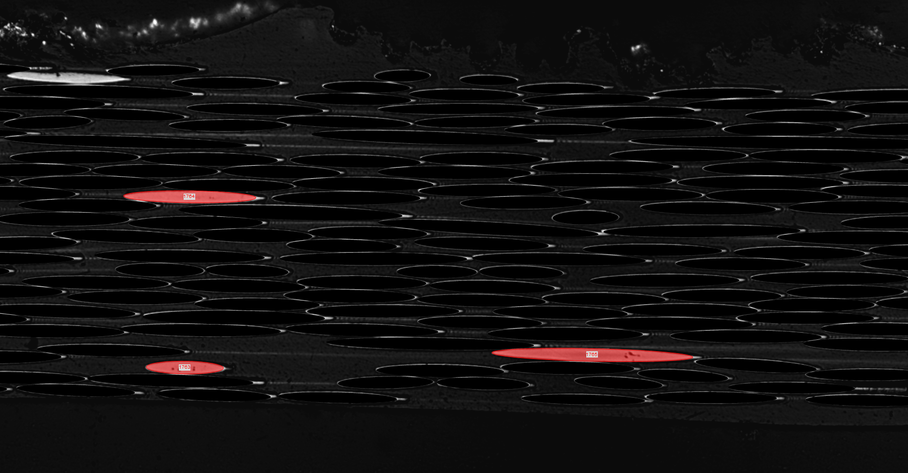
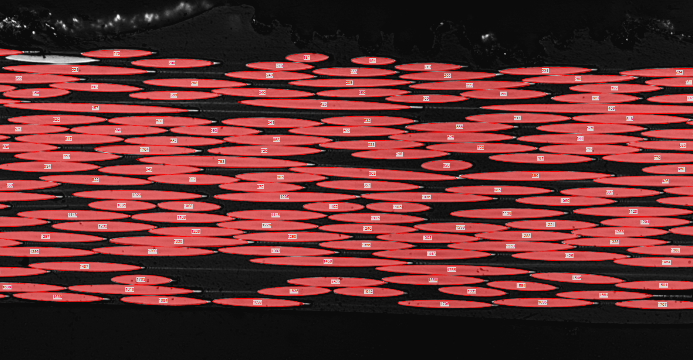

# Fibre ellipse detection using Mathematica

Mathematica scripts written to detect fibres and characterize their size and orientation.  A full discussion of the method and procedure can be found in [my dissertation](https://open.library.ubc.ca/cIRcle/collections/ubctheses/24/items/1.0375794) or in a peer reviewed [journal paper](https://www.sciencedirect.com/science/article/pii/S1359835X18301593?via%3Dihub).

The final goal of this method is to extract the centroid position, orientation, major diameter, and minor diameter of each fibre in the micrograph.  From a functional standpoint, the image processing involves first importing a micrograph or mosaic; .  The whole procedure for fitting the ellipses is shown below on an example section of a micrograph.  

The first procedure performed on the image is a scaling operation to transform the normally high aspect ratio ellipses into more circular shapes which makes the subsequent image analysis much more successful.  A scaling parameter of 9, (stretching the image by a factor of 3 in the vertical direction while shrinking the image by a factor of 3 in the horizontal direction), was found to work well; however, any value which returns good fits is appropriate.  With the stretched micrographs, a binarize operation is performed to separate the fibres from the surrounding resin.  Then a watershed transformation is applied to the binarized image using a the maximum values of the distance transform as seed points.  Finally, Mathematica's component measurements operation is applied to return the centroid, orientation, and diameters of the watersheded ellipses.  There is some subsequent anomaly detection and manual removal/addition of ellipses.

Each step is outlined with a corresponding image below.

These scripts were written to analyze the ellipses created after sectioning carbon fibre reinforced polymers.  As a result, the carbon fibres appear as white ellipses surrounded by an opaque resin system with high contrast at the interface.  An example of the raw imported micrograph is:

||
|:--:|
| *Raw micrograph* |

The remainder of the fitting procedure is mostly automated.  There is some anomoly catching and manual removal/addition to the output matrix.  The first automated step involved binarizing the image using Mathematica's default Otsu method:

||
|:--:|
| *Binarize operation* |

The seed points for the watershed components operation are obtained by applying the distance transform to the binarized imaged.  This operation creates an image where the intensity of each pixel reflects its distance to the nearest background pixel.  Thresholding this image using the max detect operation then returns likely centroid positions of the fibres.

||
|:--:|
| *Distance transform* |

||
|:--:|
| *Max detect operation* |

The watershed components function using the previously determined seed locations returns a matrix of segmented values corresponding to each ellipse.  This is visualized by the following colour map:

||
|:--:|
| *Watershed components* |

The following steps involve error detection.  First, ellipses with minor diameters below a certain threshold are removed from the analysis as they are artefacts caused from voids or reflections.  Then, ellipses with major and minor diameters which are below the 10th and above the 90th percentile are highlighted to ensure the automated fitting is correct.  These are shown below.  The user then needs to select which of these ellipses are incorrect and copy them into a table to be removed from the dataset.

||
|:--:|
| *Anomaly detection* |

With the mostly automated strategy complete, the final fitted ellipses should look like this:

||
|:--:|
| *Output of the automated strategy* |

For completeness sake, the fibres which have not been fit can be added by selecting points along the periphery and copying those values into a table which the remainder of the script can use to reconstruct the best fit ellipse.  Typically 5-6 points along the periphery return very close fitting ellipses.  To make this step easier, the fitted ellipses are set to the background colour allowing the user to easily detect which ellipses have not been successfully fit.

||
|:--:|
| *Blacked out image with fibres without corresponding fitted ellipses* |

Selecting several points along the periphery and allowing the script to reconstruct the best fit ellipses returns the manually constructed ellipses below:

||
|:--:|
| *Manually added ellipses* |

Finally, the fully fit micrograph with each fibre uniquely defined by an ellipse.

||
|:--:|
| *Final output image* |

Note, there may still be fibres which have no been fit, this can be due to partial fibres at the boundary, severely damaged fibres where manual fitting is ambiguous, or fibres which grossly violate the straight fibre assumption used in this analysis.

If you have any questions on this procedure or if you have any comments, please feel free to contact me or take a look at my website (www.andrewstewart.ca).
